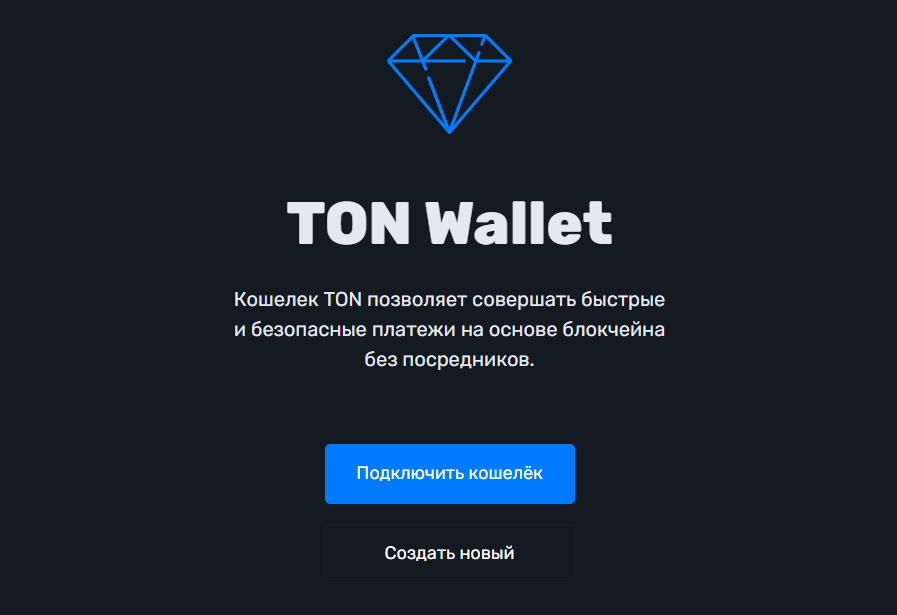

# Создание нового кошелька

1. Нажмите на кнопку "Создать новый"
2. Появится окно с предупреждением чтобы вы взяли ручку и лист бумаги для записи seed-фраз: Нажмите кнопку "Ок, продолжаем"
3. Появится окно с 24 словами, которые вам нужно сохранить в том порядке, в котором они указаны. Советуем написать на листах бумаги и хранить в надёжных местах.&#x20;
4. Пройдите проверку по seed-фразе.
5. Необходимо создать пароль для подтверждения транзакций.&#x20;

.png>)

.png>)

.png>)

.png>)

.png>)

Теперь у вас есть собственный кошелек на блокчейне TON, который уже готов к работе.

Приятного пользования!
